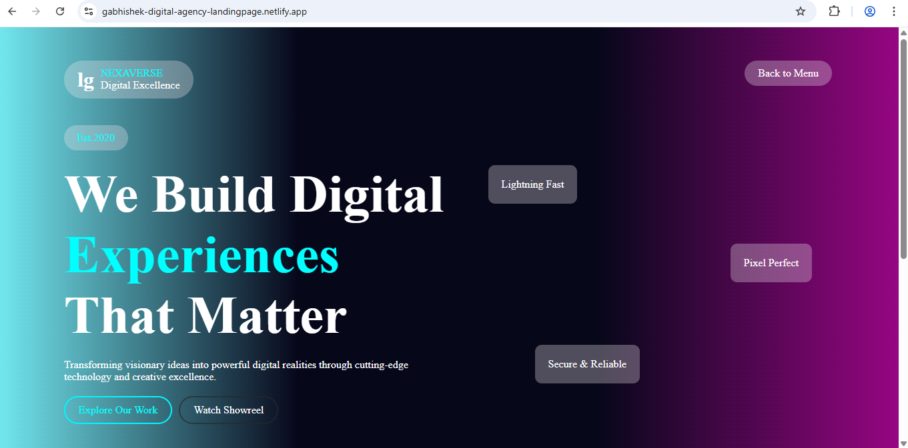
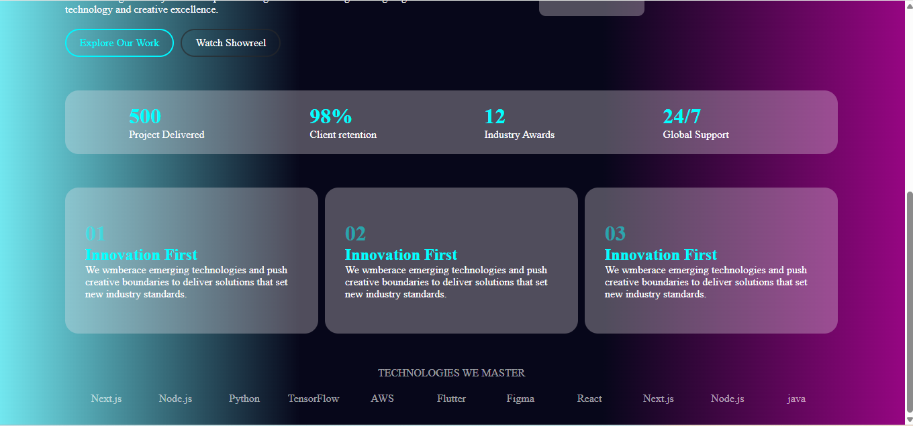

# 🚀 Nexaverse – Digital Agency Landing Page

A modern and professional **Digital Agency Landing Page** built using pure **HTML5 & CSS3**.

This project represents a fictional creative technology company called **Nexaverse**, focused on building powerful digital experiences.

---
## View live
Open this link to view project
```
https://gabhishek-digital-agency-landingpage.netlify.app/

```
## 📸 Screenshot



## 📌 Project Overview

Nexaverse is a structured and visually clean landing page that includes:

- Navigation bar
- Hero section
- Feature highlights
- Company achievements
- Core values section
- Technology stack showcase
- Footer section

This project demonstrates strong fundamentals in semantic HTML and structured layout design.

---

## 🖥️ Tech Stack

- HTML5
- CSS3
- Responsive Layout Design
- Flexbox (for layout structuring)

---

## 📂 Project Structure

```
project-folder/
│
├── index.html
├── style.css
└── README.md
```

---

## 🎯 Sections Included

### 🔹 Navigation Bar
- Brand Logo (LG)
- Company Name (NEXAVERSE)
- Tagline (Digital Excellence)
- Back to Menu link

### 🔹 Hero Section
- Establishment Year (Est. 2020)
- Main Headline:
  "We Build Digital Experiences That Matter"
- Description paragraph
- CTA Buttons:
  - Explore Our Work
  - Watch Showreel

### 🔹 Feature Highlights
- Lightning Fast
- Pixel Perfect
- Secure & Reliable

### 🔹 Company Achievements
- 500 Projects Delivered
- 98% Client Retention
- 12 Industry Awards
- 24/7 Global Support

### 🔹 Core Values Section
- Innovation First
- Creative Excellence
- Industry Leadership

### 🔹 Technologies We Master
- Next.js
- Node.js
- Python
- TensorFlow
- AWS
- Flutter
- Figma
- React
- Java

---

## 🚀 How to Run

1. Download or Clone the repository
2. Open the project folder
3. Double-click on `index.html`
4. Open in any browser

No additional setup required.

---

## 📈 Future Improvements

- Make fully responsive for mobile devices
- Add animations using CSS transitions
- Add hover effects
- Convert into React or Vue version
- Add contact form with backend integration

---

## 💡 Learning Outcomes

This project helps improve:

- HTML structuring skills
- Landing page layout design
- Content hierarchy planning
- Frontend UI thinking

---
## 👨‍💻 Author:
Developed by  **Abhishek Gorinta**

## 📝 License

This project is free to use and modify for learning purposes.

⭐ If you like this project, don't forget to give it a star on GitHub!
